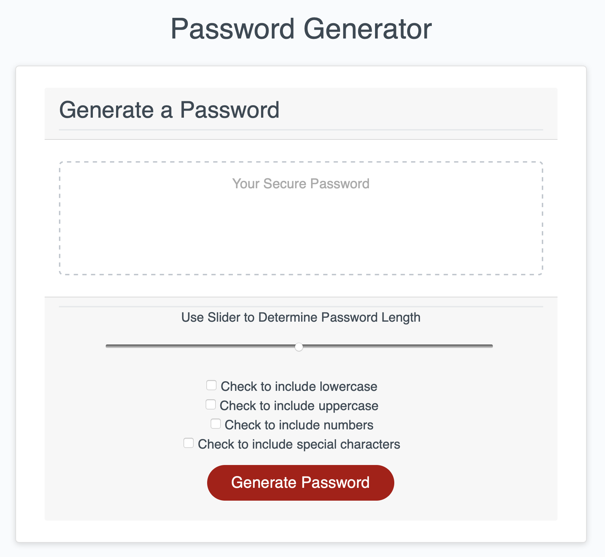

# 3-Password-Generator

- URL: https://edsloane.github.io/3-Password-Generator/index.html

## Process

- Linked the .html to Bootstrap
- Setup .html with a slider for the password length and check buttons for the password parameters. 
- in js, created a welcome alert
- then created a for loop within the writePassword function with multiple else/if statements containing strings with all the possible combinations of selected criteria. The statments then generated a random combination of each string. These combinations were set to output at the slider length. 
- then outside of the loop I created an alert to notify if no criteria has been selected. 
- then setup slider bar in css/js to show the length selected.



## User Story

```
AS AN employee with access to sensitive data
I WANT to randomly generate a password that meets certain criteria
SO THAT I can create a strong password that provides greater security
```

## Acceptance Criteria

```
GIVEN I need a new, secure password
WHEN I click the button to generate a password
THEN I am presented with a series of prompts for password criteria
WHEN prompted for password criteria
THEN I select which criteria to include in the password
WHEN prompted for the length of the password
THEN I choose a length of at least 8 characters and no more than 128 characters
WHEN prompted for character types to include in the password
THEN I choose lowercase, uppercase, numeric, and/or special characters
WHEN I answer each prompt
THEN my input should be validated and at least one character type should be selected
WHEN all prompts are answered
THEN a password is generated that matches the selected criteria
WHEN the password is generated
THEN the password is either displayed in an alert or written to the page
